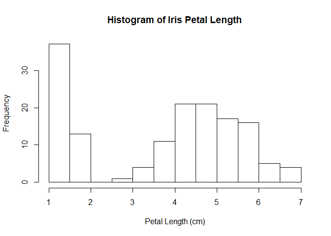
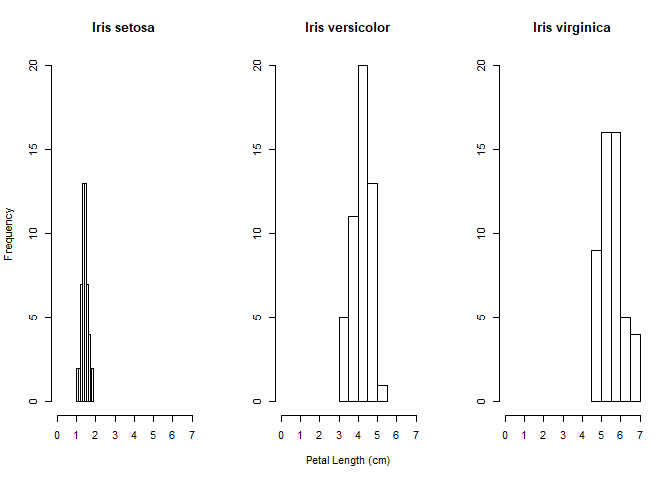

STAT545 Homework 1: R Markdown
================
Jessica Schaub
September 14, 2018

Introduction
------------

This document is part of a homework assignment for the STAT545A course at UBC. The assignment is designed to allow students to explore the features of an R Markdown document by exploring a data set. Here, we will be using the "Iris" data set, which measures sepals and petals in centimeters of three species of iris flowers:

    ##   Sepal.Length Sepal.Width Petal.Length Petal.Width Species
    ## 1          5.1         3.5          1.4         0.2  setosa
    ## 2          4.9         3.0          1.4         0.2  setosa
    ## 3          4.7         3.2          1.3         0.2  setosa
    ## 4          4.6         3.1          1.5         0.2  setosa
    ## 5          5.0         3.6          1.4         0.2  setosa
    ## 6          5.4         3.9          1.7         0.4  setosa

Exploring the Data
------------------

Using the ability to write R code to generate results, we can explore the data set in greater detail

### Data size

The dimensions of the data set:

    ## [1] "Rows: 150"

    ## [1] "Columns: 5"

### Data Type

The type of data in the data set:

    ## [1] "Sepal Length: numeric"

    ## [1] "Sepal Width: numeric"

    ## [1] "Petal Length: numeric"

    ## [1] "Petal Width: numeric"

    ## [1] "Species: factor"

### Breaking it Down Further

Other useful information may include the number of observations for each species:

    ## 
    ##     setosa versicolor  virginica 
    ##         50         50         50

Plotting the Data
-----------------

We can also use the R code to plot

### The Distribution of Petal Length

Since I have no clue what a *sepal* is, here is a histogram of the petal length:

There is a strange distribution here, is it possible that this is related to the species? Let's check:

Yes, it looks like the petal size range for each species is different!

Of course, R Markdown combines the features of Markdown and R, so we can plot the information and also include an image of each species!

Statistics
----------

Finally, we can use the R code to generate statistics on our data

### Summary

We can output a summary of all major statistics for each variable:

    ##   Sepal.Length    Sepal.Width     Petal.Length    Petal.Width   
    ##  Min.   :4.300   Min.   :2.000   Min.   :1.000   Min.   :0.100  
    ##  1st Qu.:5.100   1st Qu.:2.800   1st Qu.:1.600   1st Qu.:0.300  
    ##  Median :5.800   Median :3.000   Median :4.350   Median :1.300  
    ##  Mean   :5.843   Mean   :3.057   Mean   :3.758   Mean   :1.199  
    ##  3rd Qu.:6.400   3rd Qu.:3.300   3rd Qu.:5.100   3rd Qu.:1.800  
    ##  Max.   :7.900   Max.   :4.400   Max.   :6.900   Max.   :2.500  
    ##        Species  
    ##  setosa    :50  
    ##  versicolor:50  
    ##  virginica :50  
    ##                 
    ##                 
    ## 

### Individual

Or we can calculate individual statistics as required:

    ## [1] "Mean petal length of Iris versicolor: 4.26 cm"
